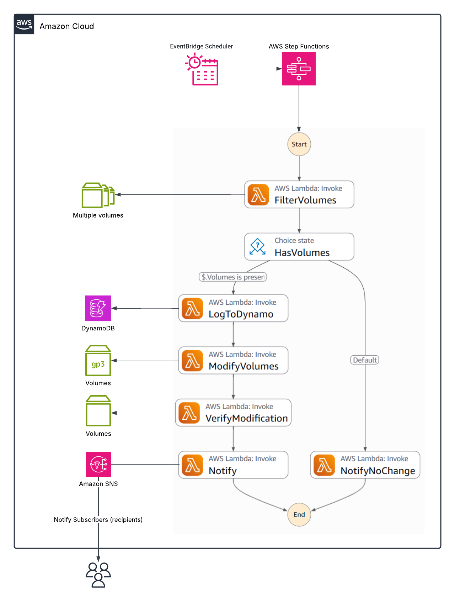

# Intelligent EBS Auto Converter

## Overview

The Intelligent EBS Auto Converter is a serverless automation framework designed to streamline the management of Amazon EBS volumes across AWS environments. It allows teams to define rule-based workflows—such as volume type conversions, tagging policies, or compliance actions—and execute them automatically on a scheduled basis.

This solution is tag-driven, fully auditable, and integrates tightly with AWS-native services.

---

## Key Features

- **Automated Volume Management**: Automatically identify and process EBS volumes based on defined tags or conditions.
- **Flexible Architecture**: Built with modular AWS Lambda functions and AWS Step Functions for easy extension or customization.
- **Audit Logging**: All actions are logged in DynamoDB for traceability.
- **Notifications**: Summary reports are sent via Amazon SNS to stakeholders.
- **Safe Execution**: Optional dry-run mode, timeouts, and status verification reduce operational risk.
- **Tag-Based Control**: Only volumes with specific tags (e.g., `AutoConvert=true`) are included in processing.

---

## Architecture Diagram



---

## AWS Services Used

| Service        | Role in Framework                             |
|----------------|-----------------------------------------------|
| **Lambda**     | Executes logic: filter, modify, log, notify   |
| **Step Functions** | Orchestrates the multi-step process     |
| **DynamoDB**   | Stores logs and state of each volume operation |
| **SNS**        | Sends summary notifications via email         |
| **EventBridge**| Triggers the workflow on a schedule    |
| **IAM**        | Manages secure access across services         |

---

## IAM Roles & Permissions

### Lambda Execution Role

Allows Lambda functions to:
- Describe, modify, and tag EBS volumes
- Log to DynamoDB
- Publish messages to SNS
- Write logs to CloudWatch

### Step Functions Role

Allows Step Functions to:
- Invoke all Lambda functions involved in the workflow

```json
{
  "Version": "2012-10-17",
  "Statement": [
    {
      "Sid": "InvokeLambdas",
      "Effect": "Allow",
      "Action": [
        "lambda:InvokeFunction",
        "lambda:InvokeAsync"
      ],
      "Resource": "<paste-arn-here>"
    }
  ]
}
```

### EventBridge Role

Allows EventBridge to:
- Start Step Functions state machine execution on a scheduled basis

```json
{
  "Version":"2012-10-17",
  "Statement":[
    {
      "Effect":"Allow",
      "Action":"states:StartExecution",
      "Resource":"<paste-arn-here>"
    }
  ]
}
```

---

## DynamoDB: `EBSVolumeConversionLog`

| Field           | Description                                 |
|------------------|---------------------------------------------|
| VolumeId         | EBS volume identifier                       |
| LoggedAt         | Timestamp when action was logged            |
| ConversionStatus | PENDING / COMPLETED / FAILED                |
| Tags             | Volume tags at time of processing           |
| Region           | AWS region of the volume                    |
| StatusMessage    | Message related to the result or failure    |

---

## Workflow

1. **Filter Volumes**  
   Lambda function scans all EBS volumes, filtering by volume type, tags.

2. **Log to DynamoDB**  
   Each selected volume is logged with metadata and marked for processing.

3. **Modify Volume (Action)**  
   Apply changes — such as converting volume type.

4. **Verify Result**  
   Poll the status and verify the outcome of the modification.

5. **Send Notification**  
   Summarize all results and notify sub's via SNS email.

---

## Environment Configuration

Each Lambda function supports environment variables to customize behavior:

- `DDB_TABLE` = Name of DynamoDB table
- `VOLUME_TYPES` = Volume type (filter volume)
- `SNS_TOPIC_ARN` = ARN of the SNS topic
- `TARGET_VOLUME_TYPE` = Target type (optional/customizable)
- `REGION` = AWS region override (optional)
- `DRY_RUN` = `true`/`false` for simulation mode

---

## Testing & Observability

- Manually trigger Step Functions execution to validate logic
- Monitor CloudWatch logs per Lambda for troubleshooting
- Use DynamoDB logs for traceability and audit

---

# Real-World Challenges Simulated & How They're Handled

---

## 1. Identifying Eligible EBS Volumes

### Challenge:

In large AWS environments, you might have hundreds or thousands of EBS volumes across multiple regions and accounts. How do you reliably and automatically find only those that qualify for conversion (e.g., gp2 → gp3)?

### Solution:

- `filter_volumes` Lambda filters by `volume-type=gp2` (volume-type according to need) and `tag:AutoConvert=true`.
- Uses paginated `describe_volumes` to scale across hundreds/thousands of volumes.

---

## 2. Audit Logging for Compliance

### Challenge:

Changes to cloud resources need to be traceable for compliance, rollback, or audit reviews.

### Solution:

- `log_to_dynamo` Lambda logs each volume change attempt to DynamoDB.
- Stores metadata like volume type, instance ID, timestamp, and conversion status.

---

## 3. Handling Failures & Timeouts

### Challenge:

EBS conversions can fail, be delayed, or stuck in “optimizing”.

### Solution:

- `verify_modification` Lambda polls status up to 5 minutes.
- Logs `COMPLETED`, `FAILED`, or `TIMED OUT` in DynamoDB.
- Adds tags on success, like `AutoConverted=true`.

---

## 4. Automated Notifications

### Challenge:

Teams don’t want to manually check logs or dashboards.

### Solution:

- `notify_sns` sends a detailed summary email after each run.
- Includes volume IDs, statuses, errors, and notes if no volumes needed action.

---

## 5. Scalability & Scheduling

### Challenge:

Manual scripts don’t scale well or run reliably on a schedule.

### Solution:

- Uses EventBridge to schedule daily runs.
- Step Functions orchestrate the workflow.
- Fully serverless: Lambdas scale automatically, no EC2 needed.

---

## 6. Safe Testing with Dry Run Mode

### Challenge:

How to safely test in production-like conditions?

### Solution:

- `modify_volume` supports `DRY_RUN=true` to simulate changes.
- No real modifications happen; useful for test/staging.

---

## 7. IAM & Least Privilege

### Challenge:

Over-permissioned roles are a security risk.

### Solution:

- IAM roles have tightly scoped actions (e.g., only `ModifyVolume`, `Publish`, `PutItem`).

---

## 8. Error Visibility & Debugging

### Challenge:

Hard to debug silent failures.

### Solution:

- All Lambdas log to CloudWatch Logs.
- Step Functions provide a visual workflow to pinpoint failure steps.

---

## 9. Avoiding Accidental Modifications

### Challenge:

Accidental conversion of critical volumes can be disruptive.

### Solution:

- Uses opt-in tagging (`AutoConvert=true`) to prevent unintended changes.
- Ensures only explicitly marked volumes are affected.

---

# Code Explaination

## 1. [`filter_volumes.py`](https://github.com/harshkhalkar/AutoVolumeManager/blob/main/lambda-function/filter_volumes.py) – Filter Volumes for Conversion

### **Purpose**

Find EBS volumes of a specific type that are tagged for conversion.

### **Key Code Elements**

- Reads `VOLUME_TYPES` from environment variables.
- Uses `ec2.describe_volumes()` with a filter on `volume-type`.
- Iterates through paginated results using a paginator.
- For each volume:
    - Retrieves tags and checks if `AutoConvert=true`.
    - If attached, extracts `InstanceId`.
    - Builds a candidate list with the following metadata:

```python
{
  'VolumeId', 'Size', 'VolumeType', 'AvailabilityZone', 'InstanceId', 'Tags'
}

```

### **Returns**

- A list of candidate volumes.
- A count of all scanned volumes.

---

## 2. [`log_to_dynamo.py`](https://github.com/harshkhalkar/AutoVolumeManager/blob/main/lambda-function/log_to_dynamo.py) – Log Volumes to DynamoDB

### **Purpose**

Save volume details to DynamoDB with a `PENDING` status.

### **Key Code Elements**

- Reads `DDB_TABLE` from environment variables.
- For each volume:
    - Builds a record with:

```python
{
  'VolumeId',
  'InstanceId',
  'Size',
  'AvailabilityZone',
  'Region',
  'Tags',
  'LoggedAt',
  'ConversionStatus': 'PENDING'
}

```

- Writes the item to DynamoDB using `put_item()`.
- Catches `ClientError` and logs the error if the write fails.
- Adds a `LoggedAt` timestamp to each volume for tracking.

---

## 3. [`modify_volumes.py`](https://github.com/harshkhalkar/AutoVolumeManager/blob/main/lambda-function/modify_volume.py) – Modify Volumes

### **Purpose**

Modify the EBS volume type using AWS API.

### **Key Code Elements**

- Reads:
    - `TARGET_VOLUME_TYPE` (default: `gp3`)
    - `DRY_RUN` flag to simulate changes without executing
- For each volume:
    - Calls `ec2.modify_volume(VolumeId, VolumeType=TARGET)`
    - If `DRY_RUN` is enabled:
        - Skips API call
        - Logs intended changes
- Serializes AWS response to a JSON-safe format.

### **Returns**

- A `ModifyResults` array containing status for each volume.

---

## 4. [`verify_modification.py`](https://github.com/harshkhalkar/AutoVolumeManager/blob/main/lambda-function/verify_modification.py) – Verify Conversion Success

### **Purpose**

Poll AWS to check if the volume type modification was successful or failed.

### **Key Code Elements**

- Reads:
    - `MAX_POLL_SECONDS`
    - `POLL_INTERVAL_SECONDS`
        
        (from environment variables)
        
- Uses `ec2.describe_volumes_modifications()` to get current modification status.

### **Key States:**

- `completed`, `optimizing` → **Success**
- `failed`, `error` → **Failure**

### **Per Volume Logic:**

- On success:
    - Tags volume with:
        - `AutoConverted`
        - `ConvertedBy`
        - `ConvertedAt`
    - Updates DynamoDB: `ConversionStatus = COMPLETED`
- On failure:
    - Updates DynamoDB: `ConversionStatus = FAILED`
- If still pending:
    - Waits and retries until timeout
- On timeout:
    - Marks volumes as failed with message:
        
        > Timed out waiting for modification
        > 

### **Returns**

- A `VerifyResults` array containing final state of each volume.

---

## 5. [`notify_sns.py`](https://github.com/harshkhalkar/AutoVolumeManager/blob/main/lambda-function/notify_sns.py) – Send Final Notification via SNS

### **Purpose**

Send a summary notification via SNS about conversion results.

### **Key Code Elements**

- Reads `SNS_TOPIC_ARN` from environment variables.
- Constructs a message:
    - Loops through `VerifyResults`
    - For each volume:
        - Logs:
            - `VolumeId`
            - Success status
            - Final state
        - Notes if the volume timed out
- Sends the message to the SNS topic using `sns.publish()`.

### **Returns**

- On success: `MessageId`
- On failure: AWS error message
